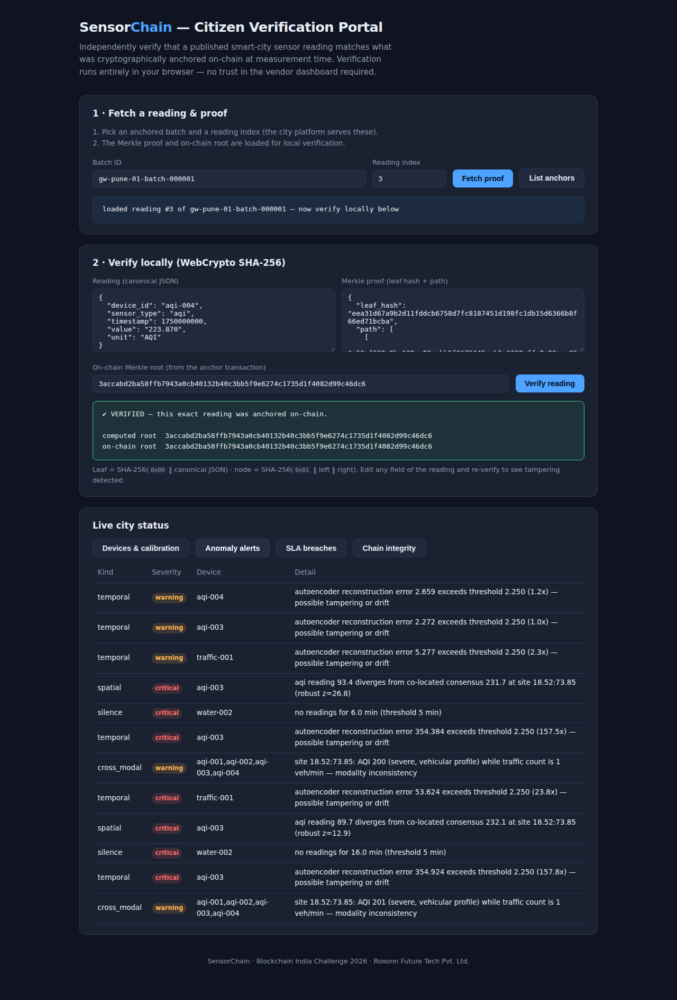

# SensorChain — Smart City IoT Data Integrity & Provenance Platform

**Blockchain India Challenge 2026 · Use Case: IoT/IIoT · Roxonn Future Tech Pvt. Ltd. (DPIIT DIPP230873)**

India's Smart Cities Mission has deployed 4M+ IoT sensors, yet a dashboard that reports *AQI = 85* offers no verifiable record of which sensor produced it, whether that sensor was calibrated, or whether the value was altered at the gateway, server, or dashboard layer. SensorChain closes that gap: a permissioned blockchain anchors device identities, calibration certificates, and per-minute Merkle roots of sensor batches — so the city SPV, CPCB, and any citizen can verify the same data independently of the vendor.

This repository is a working prototype of all six modules from the proposal, plus production Hyperledger Fabric chaincode.

## Quick start

```bash
pip install -r requirements.txt

python3 -m pytest tests/          # 42 tests
python3 demo.py                   # full pilot scenario, printed audit report
uvicorn sensorchain.api:app --port 8000   # REST API + citizen portal at http://localhost:8000/
```

`demo.py` runs the entire lifecycle on a simulated Pune shard: 9 devices across 3 vendors are registered with BIS certificates and HSM keypairs, calibrated (one deliberately skipped and auto-flagged), then 30 minutes of AQI / water-quality / traffic readings are batched and Merkle-anchored per minute. Injected faults — a pollution under-reporting sensor, a dead traffic counter under severe AQI, a water sensor going dark — are caught by the anomaly oracle, SLA breaches fire automatically with penalties, and a tampered dashboard value is shown failing its Merkle proof.

## The six modules

| Module | Where | What it does |
|---|---|---|
| Device Identity Registry | `sensorchain/contracts/device_registry.py` | On-chain identity: serial, manufacturer, **BIS IS 17927 cert (enforced)**, GPS, HSM public key. Lifecycle status events. |
| Calibration Certificate Anchor | `sensorchain/contracts/calibration.py` | Lab-signed certificate hashes anchored per device; expired/missing calibration auto-flagged on-chain. |
| Gateway Anchor Agent | `sensorchain/gateway/agent.py` | Buffers readings into 1-minute windows, computes the Merkle root, signs with the gateway HSM, anchors one small tx per window. Raw data never leaves the city platform. |
| AI Anomaly Detection Oracle | `sensorchain/oracle/` | NumPy autoencoder per device (temporal tampering/drift) + sensor-silence detection + robust spatial divergence between co-located sensors + cross-modal physics rules (severe vehicular AQI on an empty road). Findings anchored as on-chain events. |
| SLA Enforcement Contract | `sensorchain/contracts/sla.py` | Vendor SLA encoded on-chain (completeness, max silence, calibration coverage). Metrics computed from *anchored* data → automatic `SLABreach` events with penalties. |
| Public Verification Portal | `portal/index.html` | Citizen Merkle proof checker. Verification runs entirely in the browser via WebCrypto — byte-identical canonical hashing to the Python side. |

Supporting infrastructure:

- `sensorchain/merkle.py` — domain-separated SHA-256 Merkle trees, O(log n) inclusion proofs
- `sensorchain/identity.py` — HSM abstraction (ECDSA P-256; private key never exported)
- `sensorchain/ledger.py` — city-shard ledger (hash-chained blocks, world state, events, 3 DPoA validators) + **national rollup chain** anchoring every shard's head hash
- `sensorchain/simulator.py` / `sensorchain/demo_city.py` — realistic fleet simulation with injectable fault scenarios
- `sensorchain/api.py` — the open audit API (devices, anchors, proofs, anomalies, SLA, chain validation)
- `chaincode/sensorchain/` — production **Hyperledger Fabric chaincode (TypeScript)** mirroring the four contracts, including on-chain ECDSA verification of gateway anchor signatures

## Citizen verification portal

Fetch any anchored reading and its proof, then verify locally — or tamper with one field and watch it fail:



## How verification works

1. Every reading is hashed as `SHA-256(0x00 ‖ canonical-JSON)`; pairs combine as `SHA-256(0x01 ‖ left ‖ right)` up to the batch root.
2. The gateway signs `gateway|batch|root|window|count` with its HSM key; the anchor contract verifies this against the public key registered at procurement before accepting.
3. Only the 32-byte root goes on-chain (~1085 readings → 30 anchor transactions in the demo).
4. Anyone holding a reading + Merkle path recomputes the root in O(log n) and compares it with the on-chain anchor. An altered value, timestamp, or device ID changes the leaf hash and the proof fails.

## Architecture

See [docs/ARCHITECTURE.md](docs/ARCHITECTURE.md) for the full design: city-cluster DPoA sharding (each city an independent 3-node shard, national rollup for cross-city audit), data flow, trust model, and the mapping from prototype components to the production Fabric deployment.

## Repository layout

```
sensorchain/          core Python package (contracts, gateway, oracle, ledger, API)
chaincode/sensorchain production Hyperledger Fabric chaincode (TypeScript, compiles clean)
portal/               citizen verification portal (self-contained HTML + WebCrypto)
tests/                42 pytest tests (merkle, contracts, oracle, gateway, API)
demo.py               end-to-end pilot scenario with printed audit report
docs/                 architecture documentation and screenshots
```
